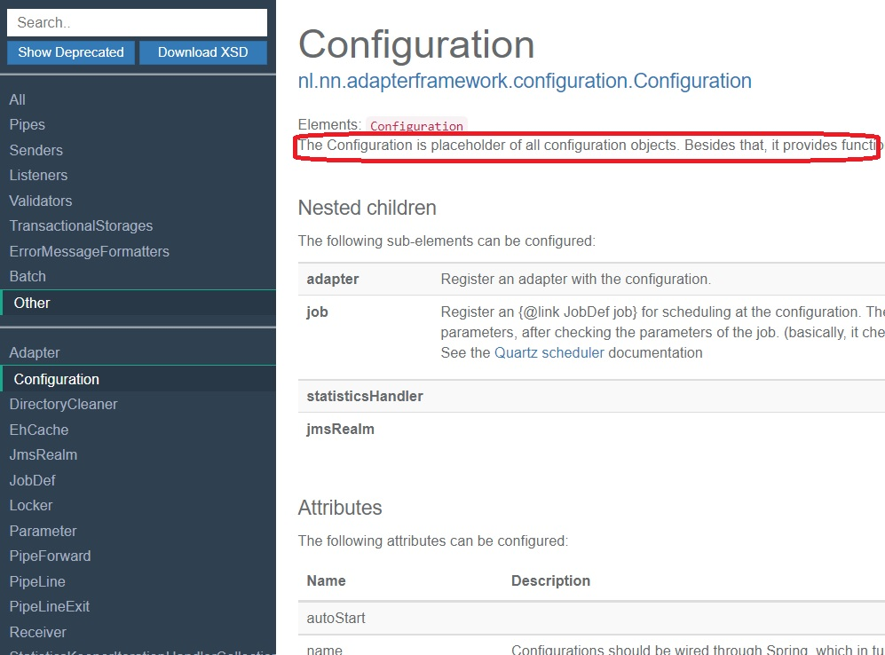

# Frank!Doc user manual for F!F developers

## Introduction

By editing the Java code of the Frank!Framework, you update both the behavior of the F!F and the documentation of that behavior as expressed in the Frank!Doc. See [CONTRIBUTING.md](./CONTRIBUTING.md).

The Frank!Doc documents the following:
* XML elements that Frank developers can use in their Frank config XML documents.
* XML attributes allowed in these XML elements.
* Descriptions that a Frank developer sees for the elements and the attributes.
* The default values of XML attributes.
* Groups shown in the Frank!Doc webapplication.
* Parameters.

The Frank!Framework parses a Frank configuration into a Java object of type [Configuration](./core/src/main/java/nl/nn/adapterframework/configuration/Configuration.java). This object recursively contains child objects. These objects have JavaBean properties that are configured with setter methods (property `xyz` has setter `setXyz()`). The Frank!Framework accesses these objects to do the job that the Frank developer intends.

This document helps you to write the right Java code, including JavaDocs and Java annotations, in such a way that the Frank!Doc remains correct and useful. It explains how to define the object relations that can exist within a configuration. It also shows how to define properties that are usually configured by Frank developers through XML attributes. And there is additional information about groups in the Frank!Doc web application and parameters.

## Expressing the root object

#### Root object and root XML elements automatic

A Frank configuration is always expressed as an object of class [Configuration](./core/src/main/java/nl/nn/adapterframework/configuration/Configuration.java). The Frank!Doc defines a corresponding XML element `<Configuration>` that should be the root element of a Frank configuration. This happens automatically. You do not have to add any JavaDoc or annotation to class [Configuration](./core/src/main/java/nl/nn/adapterframework/configuration/Configuration.java) to define it as the root object.

The Frank!Doc also defines another element that can be the root of an XML file, namely `<Module>`. This will be the case when pull request https://github.com/ibissource/iaf/pull/2186 will have been merged. `<Module>` is the only XML element that has no relation to a Java class within this repository. You do not have to add any Java class, Java annotation or JavaDoc to introduce `<Module>`. XML files starting with a `<Module>` element are meant to be included as XML entity references. Using entity references is explained in the [Frank!Manual](https://frank-manual.readthedocs.io). When the Frank!Doc parses a Frank configuration, it resolves the entity references and ignores the `<Module>` elements. The child XML elements that are allowed for `<Module>` are the same as the child elements allowed for `<Configuration>`.

#### Description

The JavaDoc comment within file [Configuration.java](./core/src/main/java/nl/nn/adapterframework/configuration/Configuration.java) above the class declaration appears as description in the Frank!Doc. The first sentence appears as a tooltip help in the Frank developer's text editor. To illustrate this, assume that a Frank developer types the following in Visual Studio Code:

```
<Configuration
  xmlns:xsi="http://www.w3.org/2001/XMLSchema-instance"
  xsi:noNamespaceSchemaLocation="./frankdoc.xsd">
</Configuration>
```

If she hovers over the `<Configuration>` element, the following text appears:

```
nl.nn.adapterframework.configuration.Configuration - The Configuration is placeholder of all configuration objects.
```

The full text of the JavaDoc comment in [Configuration.java](./core/src/main/java/nl/nn/adapterframework/configuration/Configuration.java) appears in the Frank!Doc web application as shown below:



The first sentence of class Configuration's JavaDoc has to end with ". ", not only ".". You can have a first sentence like "This object accesses x.y.z to do my job.". A dot directly followed by a newline is also considered as the end of a sentence.

The `<Module>` object gets its description automatically. You do not add it as a JavaDoc comment.

## Expressing nested objects

When you want some parent object within a configuration to contain child objects, you need to consider the following:
* What role do the children play within the parent?
* Is the Java class of the child fixed, or are there multiple possible Java classes?
* The parent object that can contain the children.
* What is the preferred order of the child elements within the parent?

#### Child role

Roles of children are managed in resource file [digester-rules.xml](./core/src/main/resources/digester-rules.xml). This file has lines that look as follows:

	<rule pattern="*/adapter" registerMethod="registerAdapter" />

These lines have XML element `<rule>` with attributes `pattern` and `registerMethod`. The pattern consists of words separated by `/`. The word after the last `/` is the *role name*. The `registerMethod` gives the name of a Java method (config child setter), in our example `registerAdapter`. When you add a method that has as its name the `registerMethod` of a `<rule>`, then you may be introducing contained elements (children) that have as their role the role name of the `<rule>`. In our example, method `registerAdapter()` is a config child setter that introduces children with role `adapter`. When the Frank!Framework parses a configuration, it executes the config child setter to register the child element with the parent element. In our example, the method `registerAdapter()` of the [Configuration](./core/src/main/java/nl/nn/adapterframework/configuration/Configuration.java) object is executed to link the [Adapter](./core/src/main/java/nl/nn/adapterframework/core/Adapter.java) object to the [Configuration](./core/src/main/java/nl/nn/adapterframework/configuration/Configuration.java) object.

Most patterns in [digester-rules.xml](./core/src/main/resources/digester-rules.xml) start with a `*` and have only one `/`, but some patterns are different. Such patterns constrain the role names of the parent elements of the child elements. These constraints are not documented by the Frank!Doc though. They are only enforced when a configuration is parsed.

The role name of the child element determines whether the child element can appear only once within its parent, or that the parent can contain the child element multiple times. If the name of the config child setter starts with `set`, then the child can appear only once. If the name starts with `add` or `register`, then the child is allowed to appear multiple times.

In the example of parent [Configuration](./core/src/main/java/nl/nn/adapterframework/configuration/Configuration.java) and child [Adapter](./core/src/main/java/nl/nn/adapterframework/core/Adapter.java), the config child setter name is `registerAdapter`. This word starts with `register` and therefore a `<Configuration>` can have multiple `<Adapter>` elements. Class [Adapter](./core/src/main/java/nl/nn/adapterframework/core/Adapter.java) uses method `setPipeLine()` to define the `<Pipeline>` element. The method's name starts with `set`, so an `<Adapter>` can have only one `<Pipeline>` element.

#### Child Java class

What Java classes can be referenced by a config child? A config child setter always has one argument. The argument's type determines the Java classes that can be referenced. If the argument is not a Java interface, then only that Java class can be referenced. Class [Configuration](./core/src/main/java/nl/nn/adapterframework/configuration/Configuration.java) has config child setter `registerAdapter()` that has argument type [Adapter](./core/src/main/java/nl/nn/adapterframework/core/Adapter.java). [Adapter](./core/src/main/java/nl/nn/adapterframework/core/Adapter.java) is not a Java interface, so the only Java class that can be referenced by the config child is [Adapter](./core/src/main/java/nl/nn/adapterframework/core/Adapter.java).

If the config child setter has a Java interface as its argument type, then any Java class that implements the interface can be referenced. As an example, consider config child setter `setListener` in class [Receiver](./core/src/main/java/nl/nn/adapterframework/receivers/Receiver.java) that has argument type [IListener](./core/src/main/java/nl/nn/adapterframework/core/IListener.java). [IListener](./core/src/main/java/nl/nn/adapterframework/core/IListener.java) is a Java interface, so the config child can reference any Java class that implements [IListener](./core/src/main/java/nl/nn/adapterframework/core/IListener.java).

#### XML element names

The role name of a config child and the Java class you want to reference (as allowed by the config child) determine the XML element. This is the XML element that is used in a Frank configuration. The rules depend on whether the config child setter's argument is a Java interface or not.

For a non-interface config child setter, the XML element name is the role name transformed to camel case (first letter is capitalized). In the example of `registerAdapter()`, the role name is `adapter`. Therefore the XML element name is `<Adapter>`. A more interesting example is config child setter `registerForward()` with pattern `*/forward`. This method typically has argument [PipeForward](./core/src/main/java/nl/nn/adapterframework/core/PipeForward.java), which is not a Java interface. Therefore this config child has XML element name `<Forward>`, even though the Java class name is `PipeForward`.

For an interface config child setter, the rules are as follows:
* A suffix is calculated that will be removed. The calculation starts with the config child setter's argument name. If any Java class in this repository implements a config child setter that takes a super-interface, then that super interface is taken, recursively. The suffix is the simple name of the chosen interface, but if the name starts with "I" then the "I" is not included in the calculated suffix.
* The name of the referenced Java class is reduced by removing the calculated suffix. Then the camel-cased role-name is appended.
* A second XML element is introduced that is called the generic element option. The generic element option is treated in a separate subsection.

**Example 1:** Class [Receiver](./core/src/main/java/nl/nn/adapterframework/receivers/Receiver.java) has config child setter `setLisetner()` that takes [IListener](./core/src/main/java/nl/nn/adapterframework/core/IListener.java). In [digester-rules.xml](./core/src/main/resources/digester-rules.xml), it can be seen that the role name is `listener`. The config child can reference any implementation of interface [IListener](./core/src/main/java/nl/nn/adapterframework/core/IListener.java), for example class [ApiListener](./core/src/main/java/nl/nn/adapterframework/http/rest/ApiListener.java). What XML element references Java class [ApiListener](./core/src/main/java/nl/nn/adapterframework/http/rest/ApiListener.java) that is used as a `listener`? Here is the calculation:
* [IListener](./core/src/main/java/nl/nn/adapterframework/core/IListener.java) has no super interfaces, so the suffix is based on the name of this Java interface.
* The simple name starts with `I`, so the suffix becomes `Listener`.
* The name `ApiListener` is reduced by removing the suffix, resulting in `Api`.
* The name is appended by adding the camel-cased role name, `Listener`. The result is `ApiListener`. This equals the simple name of the Java class, which is no coincidence. If the camel-cased role name equals the simple name of the config child setter's argument (except for the letter `I`), then the XML element name equals the class name.

Another implementation of [IListener](./core/src/main/java/nl/nn/adapterframework/core/IListener.java) is [RestListener](./core/src/main/java/nl/nn/adapterframework/http/RestListener.java). A Frank config uses XML element `<RestListener>` to reference a [RestListener](./core/src/main/java/nl/nn/adapterframework/http/RestListener.java) object that is used as a `listener`. Question: Is the following snippet allowed in a Frank config:

```
<Receiver>
	<ApiListener ... />
	<RestListener .../>
</Receiver>
```

The answer is no. The config child setter's name is `setLisener`, so the child can appear only once within its parent.

**Example 2:** Class [Receiver](./core/src/main/java/nl/nn/adapterframework/receivers/Receiver.java) has config child setter `setErrorSender()` that takes [ISender](./core/src/main/java/nl/nn/adapterframework/core/ISender.java). The role name is `errorSender`. The child defined by this config child setter can reference any implementation of Java interface [ISender](./core/src/main/java/nl/nn/adapterframework/core/ISender.java), for example [LogSender](./core/src/main/java/nl/nn/adapterframework/senders/LogSender.java). What XML element is used to reference a [LogSender](./core/src/main/java/nl/nn/adapterframework/senders/LogSender.java) that is used as an `errorSender`? Here is the calculation:
* [ISender](./core/src/main/java/nl/nn/adapterframework/core/ISender.java) has super interface [IConfigurable](./core/src/main/java/nl/nn/adapterframework/core/IConfigurable.java) which has super interfaces [INamedObject](./core/src/main/java/nl/nn/adapterframework/core/INamedObject.java) and [IConfigurationAware](./core/src/main/java/nl/nn/adapterframework/core/IConfigurationAware.java). None of these super interfaces appears as the argument of some config child setter, so the Java interface to start from remains [ISender](./core/src/main/java/nl/nn/adapterframework/core/ISender.java).
* The suffix to remove becomes `Sender`.
* The name `LogSender` is reduced by removing `Sender`, which results in `Log`.
* The camel-cased role name is appended, resulting in XML element `<LogErrorSender>`.

Class [Receiver](./core/src/main/java/nl/nn/adapterframework/receivers/Receiver.java) also has config child setter `setSender()` that takes [ISender](./core/src/main/java/nl/nn/adapterframework/core/ISender.java). The role name is `sender` as can be seen from [digester-rules.xml](./core/src/main/resources/digester-rules.xml). This other config child allows any [ISender](./core/src/main/java/nl/nn/adapterframework/core/ISender.java) Java object that plays the role `sender`. XML element `<LogSender>` refers to a [LogSender](./core/src/main/java/nl/nn/adapterframework/senders/LogSender.java) that is used as a `sender`. Class [Receiver](./core/src/main/java/nl/nn/adapterframework/receivers/Receiver.java) implements the difference between a `<LogErrorSender>` and a `<LogSender>` by implementing methods `setErrorSender` and `setSender()` differently.

Question: Is the following XML snippet allowed in a Frank configuration?

```
<Receiver>
	<LogSender ... />
	<LogErrorSender ... />
</Receiver>
```

The answer is yes. `<LogSender>` and `<LogErrorSender` are defined by different config children because the role name is different. But it is true that each of these two config children can appear only once in the same `<Receiver>`.

**Example 3:** Class [PostboxRetrieverPipe](./core/src/main/java/nl/nn/adapterframework/pipes/PostboxRetrieverPipe.java) has config child setter `setListener` which takes [IPostboxListener](./core/src/main/java/nl/nn/adapterframework/core/IPostboxListener.java). This interface is implemented by Java class [PullingJmsListener](./core/src/main/java/nl/nn/adapterframework/jms/PullingJmsListener.java). What XML element do you use to reference this Java class in the role of `listener`? Here is the calculation:
* Interface [IPostboxListener](./core/src/main/java/nl/nn/adapterframework/core/IPostboxListener.java) has super interface [IListener](./core/src/main/java/nl/nn/adapterframework/core/IListener.java), which appears as the argument of other config child setters. The suffix calculation uses name `IListener` to arrive at suffix `Listener`.
* Name `PullingJmsListener` is reduced by the suffix `Listener` and then the role name `Listener` is appended. This produces XML element name `<PullingJmsListener>`.

#### Custom code support with the generic element option

The previous subsection explained what XML elements were introduced from a config child setter that took a Java interface. In example 1, config child setter `setLisetner()` was considered. It allowed one of `<ApiListener>`, `<RestListener>` and others as the child element of a `<Receiver>`. This section introduces another XML element that the Frank!Doc allows as well: the generic element option `<Listener>`. The Frank!Doc requires this element to have attribute `className`, which has as its value the full name of the referenced Java class. For example, the XML `<ApiListener ... />` has the same meaning as `<Listener className = "nl.nn.adapterframework.http.rest.ApiListener" .../>`.
The XML element that is defined for the generic element option is the camel-cased role name of the config child setter.

The generic element option is available for backward compatibility. It is also important because it allows Frank developers to use custom code. Suppose that a Frank developer wants to use her own Java class `com.mycompany.MyListener`. The Frank!Doc is generated from this repository only, so there will be no XML element `<MyListener>`. But when class `com.mycompany.MyListener` is available on the Java classpath at runtime, the Frank!Framework will understand `<Listener className="com.mycompany.MyListener"... />`.

The generic element option does not apply to config child setters that take a non-interface Java class.

#### Parent

In the previous section, it was explained how config child setters produce definitions of XML elements in Frank configs. This subsection covers the parent XML element to which a child XML element can be assigned, and it considers the parent object to which a child object can be linked. To select the parents to which a config child can be attached, you have to choose the Java classes in which you implement the config child setter. Below, we explain how the Java class of a config child setter influences which Java objects (or XML elements) are allowed to have the child.

Consider a Java class or Java interface `C` in combination with a role name `r`. What Java objects within a configuration are allowed to have child objects of type `C` that play role `r`? The requirements for such a parent are:
* The parent object's class should declare or inherit the config child setter of role `r`.
* The argument type of the config child setter should be a superclass of `C`.
* Deprecated Java classes or config child setters are treated specially as is explained later.
* Please mind overridden methods. The consequences of overriding config child setters are explained in a later subsection.

These rules are expressed by the Frank!Doc. If some parent XML element references a Java class that defines or inherits a config child setter that has role name `r` and has argument type `C`, then the parent XML element can have any of the child XML elements that correspond to `C` and `r`.

**Example 1:** We already considered config child setter `registerAdapter()` with role name `adapter`. This config child setter defines child element `<Adapter>`. We saw that the allowed parent element is `<Configuration>`, but why is this the case? Because it is class [Configuration](./core/src/main/java/nl/nn/adapterframework/configuration/Configuration.java) that implements method `registerAdapter()` with argument type [Adapter](./core/src/main/java/nl/nn/adapterframework/core/Adapter.java).

**Example 2:** Class [MessageSendingPipe](./core/src/main/java/nl/nn/adapterframework/pipes/MessageSendingPipe.java) implements config child setter `setSender()` with argument type [ISender](./core/src/main/java/nl/nn/adapterframework/core/ISender.java). Any object that is an instance of [MessageSendingPipe](./core/src/main/java/nl/nn/adapterframework/pipes/MessageSendingPipe.java) can have a child object that implements [ISender](./core/src/main/java/nl/nn/adapterframework/core/ISender.java) and plays the role `sender`. The child is linked to the parent by calling the (inherited) method `setSender`.

Examples of classes that inherit from [MessageSendingPipe](./core/src/main/java/nl/nn/adapterframework/pipes/MessageSendingPipe.java) are [ZipIteratorPipe](./core/src/main/java/nl/nn/adapterframework/compression/ZipIteratorPipe.java) and [SenderPipe](./core/src/main/java/nl/nn/adapterframework/pipes/SenderPipe.java). An example of a class that implements [ISender](./core/src/main/java/nl/nn/adapterframework/core/ISender.java) is [LogSender](./core/src/main/java/nl/nn/adapterframework/senders/LogSender.java). Therefore a [ZipIteratorPipe](./core/src/main/java/nl/nn/adapterframework/compression/ZipIteratorPipe.java) or a [SenderPipe](./core/src/main/java/nl/nn/adapterframework/pipes/SenderPipe.java) object can hold a [LogSender](./core/src/main/java/nl/nn/adapterframework/senders/LogSender.java) object playing the role of `sender`. As a consequence, XML elements `<ZipIteratorPipe>` and `<SenderPipe>` can both have child element `<LogSender>`.

Neither `<ZipIteratorPipe>` nor `<SenderPipe>` can have child element `<LogErrorSender>`. XML element `<LogErrorSender>` expresses a [LogSender](./core/src/main/java/nl/nn/adapterframework/senders/LogSender.java) object that plays the role `errorSender`. That role has config child setter `setErrorSender()`. This method is not implemented by [MessageSendingPipe](./core/src/main/java/nl/nn/adapterframework/pipes/MessageSendingPipe.java) and it is not implemented by any class in its inheritance hierarchy (no ancestor and no descendant class).

#### Child order

#### Description

#### Deprecating

#### What you can do by overriding config child setters

## Expression object properties

## Groups

## Parameters

## Troubleshooting

override and overload
Please mind the doclet logs
Read the doclet logs
