# Frank!Doc user manual for contributors

As a contributor to the Frank!Framework, you write JavaDoc comments that are used to generate the Frank!Doc. This document explains how your comments appear in this user documentation. It also explains some Java annotations that you need to maintain the Frank!Doc.

## What is the Frank!Doc?

From a user perspective, the Frank!Doc consists of two parts. First, Frank developers use the file `FrankConfig-strict.xsd` that is generated by the frankDoc doclet (see [CONTRIBUTING](./CONTRIBUTING.md)). Frank developers typically get this file under the name `FrankConfig.xsd`. They include a reference to this XML schema in the XML Frank configs they write. This gives them autocomplete functionality and tooltip help in their text editor.

The second part is a [web application](https://ibis4example.ibissource.org/iaf/frankdoc) with reference information about the XML-based language of Frank configurations. Both parts are shown here now to introduce you to the Frank!Doc.

#### XML schema for Frank developers

A Frank developer uses the XML schema when he writes a Frank config. He may start writing a config in Visual Studio Code as shown below:

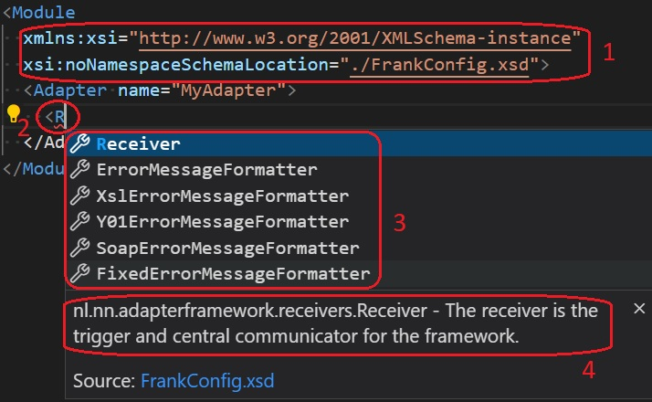

He types the text needed to reference the XML schema of the Frank!Doc (number 1). Then he writes the text `<A` (number 2). VSCode shows a red flag because this is invalid XML. VSCode can provide autocomplete help as shown (number 3). One of the options is the XML element `<Adapter>`. There is a button to get the tooltip help text of that element (number 4). This text is derived from the JavaDoc comment above the class declaration of [Adapter](./core/src/main/java/nl/nn/adapterframework/core/Adapter.java).

Frank developers not only see errors about invalid XML, but also about violations of the XML schema.

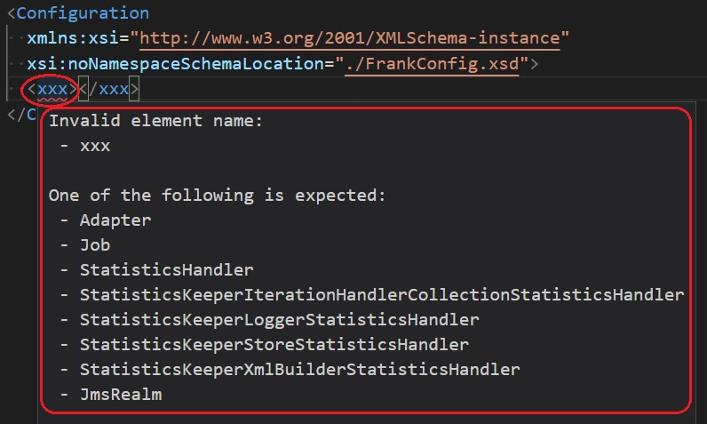

The Frank developer has used an XML element `<xxx>` that does not exist. VSCode produces a red flag. The tooltip help he can get is also shown. He sees which XML elements he can use instead of `<xxx>`.

#### Web app with reference information for Frank developers

The XML schema helps Frank developers when they are writing their configs, but they also need help while designing them. They can use the Frank!Doc web application as the reference manual. It looks like shown below:

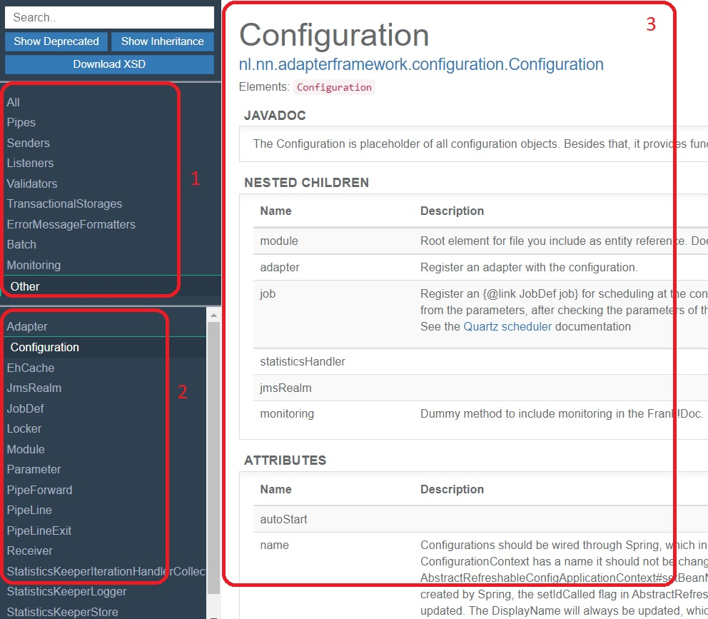

To the top-left, you see a list of groups (number 1). These groups are controlled by Java annotation [@FrankDocGroup](./core/src/main/java/nl/nn/adapterframework/doc/FrankDocGroup.java). To the bottom-left, you see the Java class names that are members of the chosen group (number 2). When you select a class name, you get information about it (number 3). More explanation of this text follows later.

## Descriptions of classes, child elements and attributes

Most descriptions you see in the Frank!Doc come from JavaDoc comments. This section shows where your JavaDoc comments appear in the Frank!Doc. Below you see some snippets of Java class [Configuration](./core/src/main/java/nl/nn/adapterframework/configuration/Configuration.java).

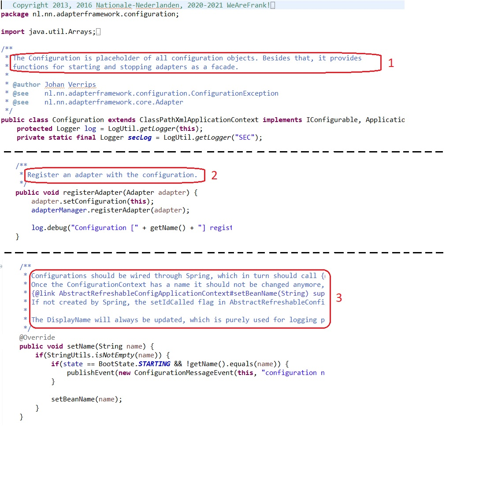

You see the JavaDoc comment of the class (number 1), the JavaDoc of a config child setter (number 2) and the JavaDoc of an attribute (number 3).

These JavaDoc comments appear in VSCode as shown below:

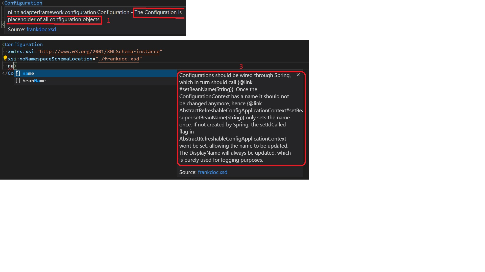

The JavaDoc comment of the class appears as help about XML element `<Configuration>` (number 1). The JavaDoc of the attribute setter appears as help about the attribute (number 3). The JavaDoc of the config child setter is not in the XML schema file (number 2 is not present).

The JavaDoc of a config child setter is available in the web application as shown below.

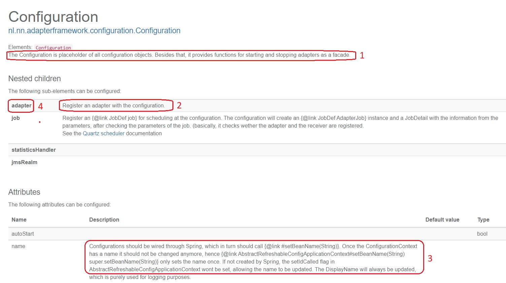

The JavaDoc of the class appears at the top of the page. The JavaDoc of the config child setter appears in the table of config children. And the JavaDoc of the attribute setter appears with the attributes. The name of the config child (number 4) does not come from file [Configuration.java](./core/src/main/java/nl/nn/adapterframework/configuration/Configuration.java). It comes from file [digester-rules.xml](./core/src/main/resources/digester-rules.xml), which contains the following line:

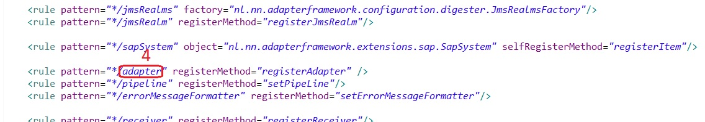

There is a `<rule>` XML element that links the name `adapter` to the name of the config child setter, `registerAdapter`.

## How Java inheritance is shown

In Java, config child setters and attribute setters are inherited like any Java method. As a consequence, attributes and config children are inherited. In `FrankConfig-strict.xsd` and in the JSON, inheritance is used to avoid unnecessary repetition and reduce file sizes. Frank developers do not see this in their text editor. Attributes look the same whether they are declared or inherited, and the same is true for child elements. In the web application however, inheritance is clearly visible as shown below:

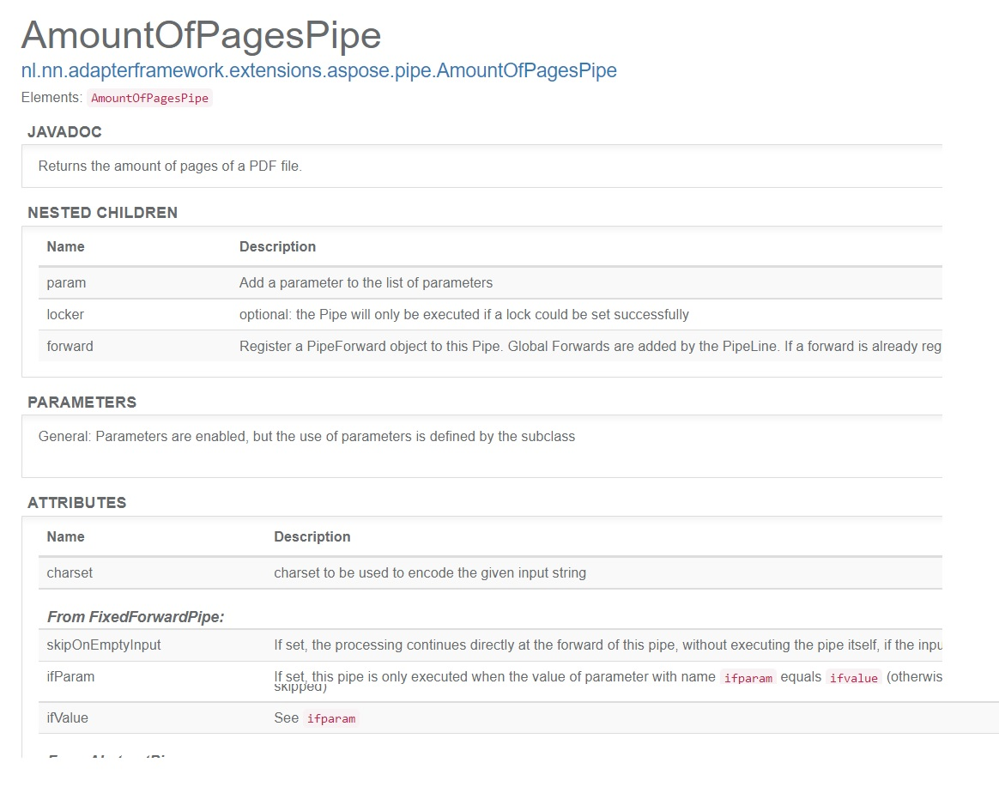

Declared config children and declared attributes go first. If config children or attributes are inherited, there is a heading with the closest ancestor from which we have inheritance. The config children and the attributes inherited from that ancestor follow. Next comes a header for the next ancestor from which config children or attributes are inherited. The recursion ends when all declared and all inherited config children and attributes are present.

## Preferred order of attributes and child elements

The order of config child setters and attribute setters in the Java code is important for the Frank!Doc. With the old IbisDoc documentation, this is not the case because the value fields in [@IbisDoc](./core/src/main/java/nl/nn/adapterframework/doc/IbisDoc.java) and [@IbisDocRef](./core/src/main/java/nl/nn/adapterframework/doc/IbisDocRef.java) annotations can hold the order. In the Frank!Doc, the order kept in [@IbisDoc](./core/src/main/java/nl/nn/adapterframework/doc/IbisDoc.java) and [@IbisDocRef](./core/src/main/java/nl/nn/adapterframework/doc/IbisDocRef.java) annotations is ignored and the method order is used.

In the Frank!Doc web application, the order of the attributes follows the order of the methods. This order is not enforced in any way in Frank configurations, because XML schemas in general do not prescribe the order of XML attributes.

The order of the config child setters defines a *preferred* order for config children (child elements). The previous section showed config children in their preferred order. The preferred order of config children follows from the following rules:
* Declared config children go first. The preferred order of the declared config children is the sequence of the config child setters in the Java source code.
* Inherited config children go after declared config children. Config children from a closer ancestor go before config children from a further ancestor.

Frank configs that violate the preferred order can still be parsed by the Frank!Framework, which is desirable for backward compatibility. The strict XSD does enforce the order as shown below:

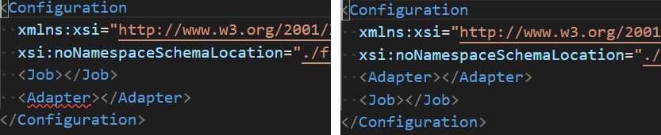

## Groups in the web application

This section is about the groups shown in the top-left of the Frank!Doc web application:

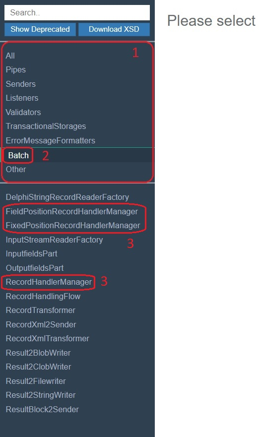

The overview of all groups is shown as number 1. We have selected group `Batch` (number 2). How does the Frank!Doc know the order of the groups and the elements they contain? First, see the following snippet of [IRecordHandlerManager](./core/src/main/java/nl/nn/adapterframework/batch/IRecordHandlerManager.java)

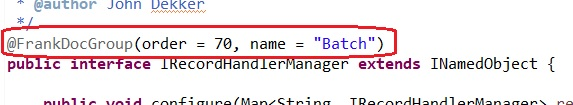

The interface has a Java annotation [@FrankDocGroup](./core/src/main/java/nl/nn/adapterframework/doc/FrankDocGroup.java). The annotation has fields `name` and `order`. The `order` is an integer that is used to sort the groups in the shown order.

When [@FrankDocGroup](./core/src/main/java/nl/nn/adapterframework/doc/FrankDocGroup.java) is placed on a Java interface, then all Java classes that implement the interface are added to the group. Here is the type hierarchy of [IRecordHandlerManager](./core/src/main/java/nl/nn/adapterframework/batch/IRecordHandlerManager.java):

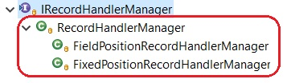

The Java classes that implement [IRecordHandlerManager](./core/src/main/java/nl/nn/adapterframework/batch/IRecordHandlerManager.java) are highlighted. They are annotated in the first figure of this section as number 3.

The annotation on [IRecordHandlerManager](./core/src/main/java/nl/nn/adapterframework/batch/IRecordHandlerManager.java) only adds three classes to group `Batch`. The other elements are added by other [@FrankDocGroup](./core/src/main/java/nl/nn/adapterframework/doc/FrankDocGroup.java) annotations. These do not have their `order` field set, see for example [RecordHandlingFlow](./core/src/main/java/nl/nn/adapterframework/batch/RecordHandlingFlow.java)

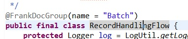

The annotation is placed on a class here. Then only that class is added to the group in the Frank!Doc web application.

Finally, Java classes that do not have or inherit a [@FrankDocGroup](./core/src/main/java/nl/nn/adapterframework/doc/FrankDocGroup.java) annotation are put in group `Other`.

## Attribute types

The Frank!Doc supports type-checking for attributes. Attributes can be Boolean, integer or string. In addition, string attributes can have their values restricted by a Java enum.

The Frank!Doc type of an attribute depends on the argument type of the setter in the Java code. Here is an example from [Adapter](./core/src/main/java/nl/nn/adapterframework/core/Adapter.java):

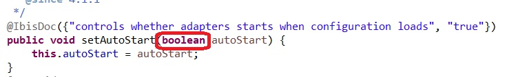

Attribute `autoStart` has a setter with argument type `boolean`. The Frank!Doc type is Boolean. Below, you see a type violation of this attribute in VSCode:

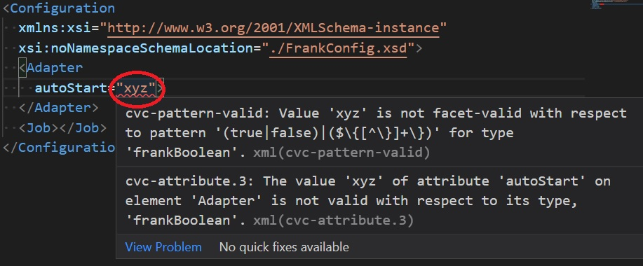

Value `xyz` is not a Boolean value and hence you see a red flag. You may be surprised by the complicated regular expression in this screenshot. It is there to allow references to properties like `${myProperty}`. Type checking is also done by `FrankConfig-compatibility.xsd`. If a configuration has type-violating attributes, the errors are detected when the configuration is loaded.

An example of a restricted string attribute is present in [HttpSenderBase](./core/src/main/java/nl/nn/adapterframework/http/HttpSenderBase.java):

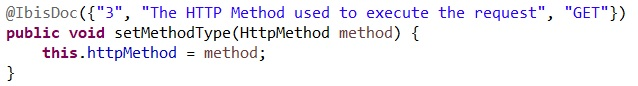

Here is the definition of enum type HttpMethod:

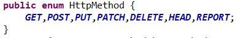

It appears as follows in the Frank!Doc website:

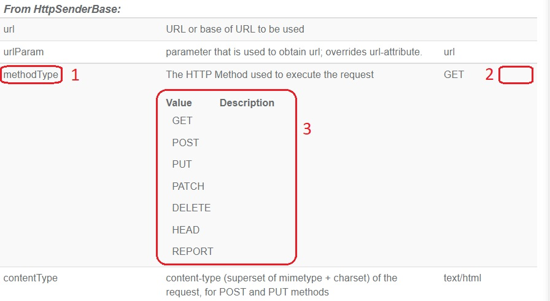

The setter `setMethodType()` produces an attribute `methodType` (number 1). The row shows an empty field for the type (number 2), but it would be filled if the attribute would be Boolean or integer. Below that all possible values are shown (number 3).

There is an alternative way to define restricted string attributes in the Java code. An example appears in [LdapSender](./core/src/main/java/nl/nn/adapterframework/ldap/LdapSender.java):

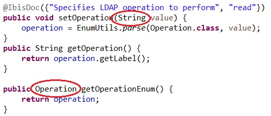

You give the attribute setter argument type String. You add a getter that appends the attribute name with the word `Enum`. The return type of the enum getter is the enum that determines what values are allowed. Part of enum `Operation` is shown below:

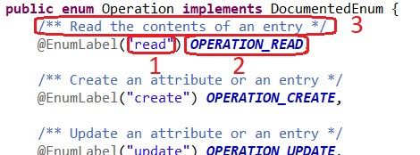

With Java annotation [@EnumLabel](./core/src/main/java/nl/nn/adapterframework/doc/EnumLabel.java), you can alter the representation of the enum value in Frank configs (number 1). In the example, the string "read" in a Frank configuration is parsed as enum value `OPERATION_READ` (number 2). JavaDoc comments of enum values are used to provide descriptions (number 3). Please note that a JavaDoc comment must come before the [@EnumLabel](./core/src/main/java/nl/nn/adapterframework/doc/EnumLabel.java). It would not work if you interchanged the two. Below you see type checking for attribute `operation` in action:

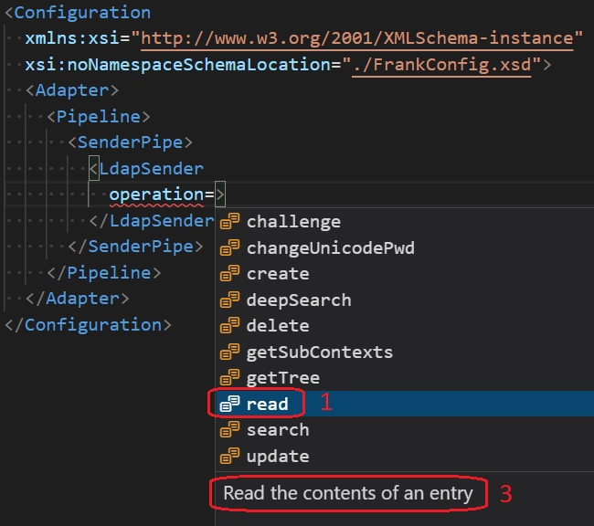

You see a list of the allowed values. Enum value `OPERATION_READ` shows up as "read" (number 1). You see the description (number 3) below the list.

In `FrankConfig-strict.xsd`, type checking against enums is case sensitive. In the example, the value "READ" for attribute `operation` would be flagged as an error. In `FrankConfig-compatibility.xsd`, type checking is case insensitive. This means that value "READ" is accepted when your configuration is parsed. This is the case to support backward compatibility.

Here is again how restricted string attributes are shown, this time with `@EnumLabel` annotations and value descriptions:

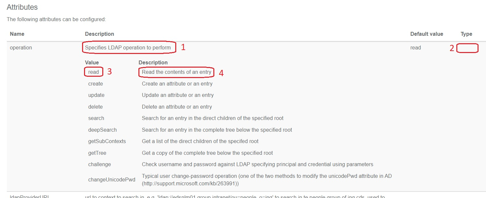

You see the description in the JavaDoc comment (or [@IbisDoc](./core/src/main/java/nl/nn/adapterframework/doc/IbisDoc.java) Java annotation) of the attribute setter (number 1). Enum-restricted string attributes do not show a type (number 2) as said earlier, but it is shown for Boolean and integer attributes. Each enum value (number 3) is shown with its description (number 4) that comes from the JavaDoc comment of the enum value.

## Attribute default value

You can document a default value for attributes. The preferred way to do this is using JavaDoc tag `@ff.default`. Using the [@IbisDoc](./core/src/main/java/nl/nn/adapterframework/doc/IbisDoc.java) Java annotation is deprecated. You document here what value is assumed if the attribute is not set. Only document this value if this default is applied already by the F!F source code. The `@ff.default` JavaDoc annotation does not alter the behavior of the Frank!Framework.

Here is how it looks like in the Java source code:

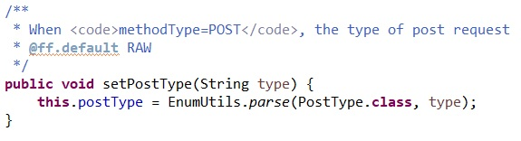

In VScode, the default value appears as tool-tip help as shown:

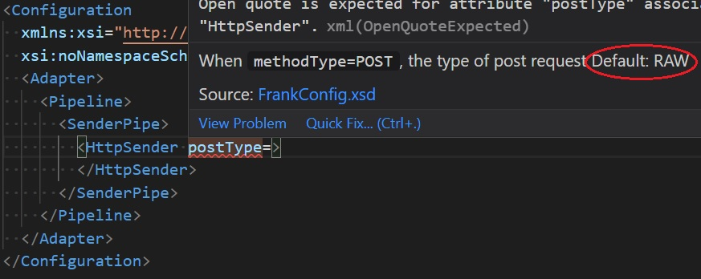

The default value is also shown in the Frank!Doc web application:

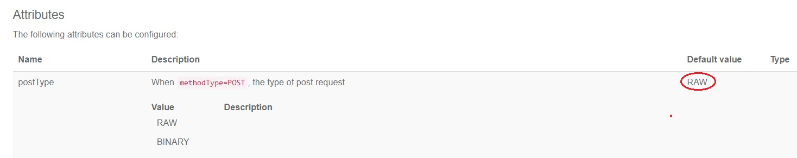

## Parameters

Some XML elements in a Frank config can have nested element `<Param>`. The meaning of this element depends on the context: parameters can be query parameters of a database query, HTTP request parameters or something else. You can document this meaning in the JavaDoc comment above a Java class declaration. You use JavaDoc tag `@ff.parameters`. An example is Java class [HttpSender](./core/src/main/java/nl/nn/adapterframework/http/HttpSender.java):

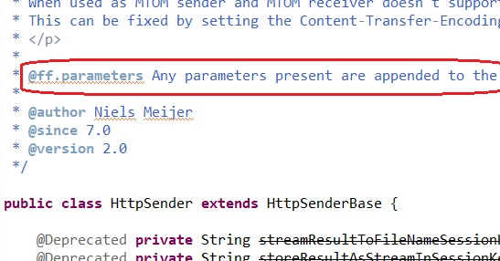

In the Frank!Doc website parameters have a separate subsection next to config children and attributes, as shown below:

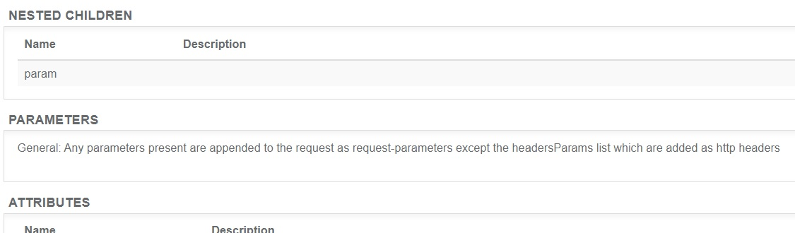

In addition to the `@ff.parameters` tag, you can use the `@ff.parameter` tag to document the meaning of specific parameters. That tag also appears in the JavaDoc comment above a class. In contrast to the `@ff.parameters` tag, the `@ff.parameter` tag can appear multiple times. An example can be found in [CompareIntegerPipe](./core/src/main/java/nl/nn/adapterframework/pipes/CompareIntegerPipe.java)

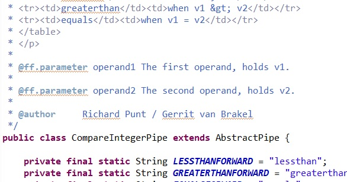

The pipe compares two values that can each be supplied through `<Param>` tags. The JavaDoc explains the meaning of the specific parameters named `operand1` and `operand2`. Here is how this appears in the Frank!Doc website:

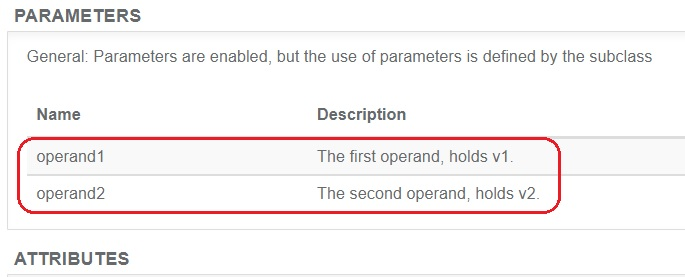

## Deprecated child elements and attributes

As a Java engineer, you know the `@Deprecated` Java annotation. You use it for Java classes and methods in a library that should no longer be used. Deprecated items only exist for backward compatibility, and they may be removed in a future version of the library. In the source code of the Frank!Framework, WeAreFrank! also uses this annotation. This section explains how `@Deprecated` attribute setters, `@Deprecated` config child setters and `@Deprecated` Java classes appear in the Frank!Doc.

First, the strict XSD that is used by Frank developers does not allow you to use `@Deprecated` items. Any attribute setter, config child setter or Java class that is `@Deprecated` does not appear in the strict XSD. Accessing it in a Frank config is flagged as an error as shown in earlier images of Visual Studio Code.

Second, `@Deprecated` items are available in `FrankConfig-compatibility.xsd`. Frank configs that reference them can be parsed by the Frank!Framework. This means that these Frank configs still do their job.

Third, you can choose in the Frank!Doc website whether you want to see `@Deprecated` items or not. Use the button shown below:

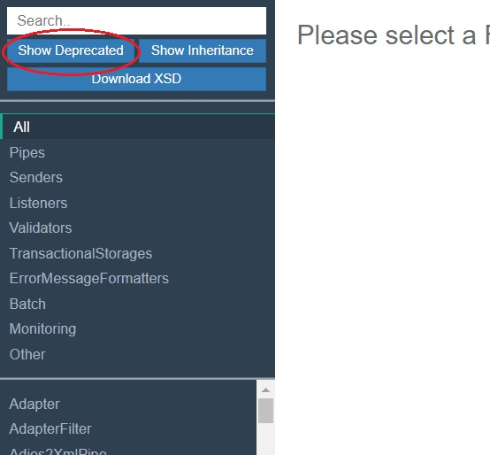

`Deprecated` Java classes are crossed out in the list of class names to the bottom-left. See the picture below for the example of [DummyTransactionalStorage](./core/src/main/java/nl/nn/adapterframework/jdbc/DummyTransactionalStorage.java):

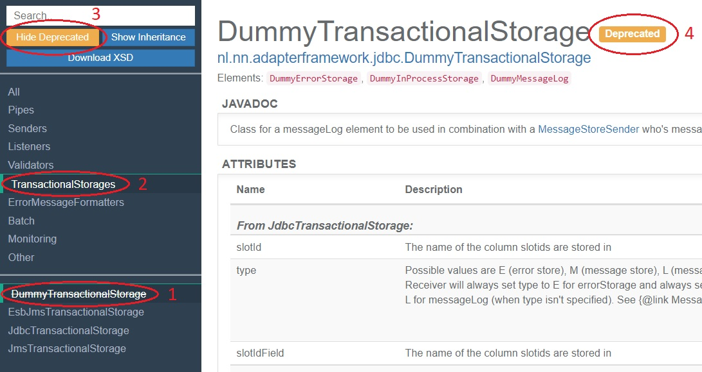

The button "Show Deprecated" has been pressed (number 3). We selected [DummyTransactionalStorage](./core/src/main/java/nl/nn/adapterframework/jdbc/DummyTransactionalStorage.java) (number 1) in group "TransactionalStorages" (number 2). To the bottom-left, you see that "DummyTransactionalStorage" is crossed out. To the right, in the information about [DummyTransactionalStorage](./core/src/main/java/nl/nn/adapterframework/jdbc/DummyTransactionalStorage.java), you see a label (number 4) showing that this class is deprecated.

Here is an example of how deprecated children look like:

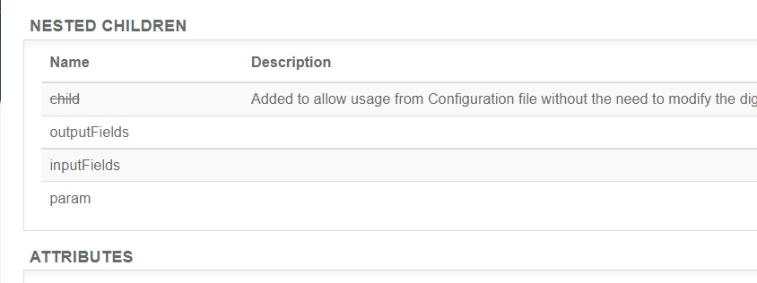

It is taken from [RecordTransformer](./core/src/main/java/nl/nn/adapterframework/batch/RecordTransformer.java). The child called "child" is crossed out because method `registerChild()` is `@Deprecated`. Similarly, attributes are crossed out in the Attributes section when their setter is `@Deprecated`.

## Other JavaDoc tags

