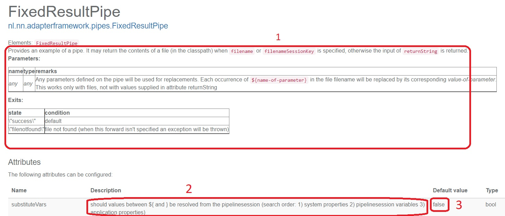
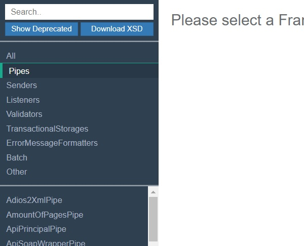

# Frank!Doc user manual for F!F developers

## General usage

The Maven build of this project includes the execution of a doclet, which is implemented in the sub-project `frankDoc`. The doclet produces the following files:
* `./target/frankDoc/js/frankDoc.json`. This file is read by a webapplication implemented in sub-project `webapp`. This web application will render the information in the JSON file. Frank developers use the website as a reference manual. See https://ibis4example.ibissource.org/iaf/frankdoc.
* `./target/frankDoc/xml/xsd/FrankConfig-strict.xsd`. This file is given to Frank developers. They reference this XSD in their Frank config XML files. When they open an XML file, their text editor will use `FrankConfig-strict.xsd` to support autocomplete and to provide tooltip information.
* `./target/frankDoc/xml/xsd/FrankConfig-compatibility.xsd`. This file is added to the Frank!Framework .jar file during the Maven build. The file is then used at runtime to parse Frank configurations.

These files define the syntax of Frank configurations written by Frank developers. They also provide documentation about the semantics, the meaning, of the XML elements and attributes in a Frank config.

The frankDoc doclet generates these files based on the Java source code of this repository, including the JavaDoc comments. The remainder of this document explains how the Java source code is used to define the syntax of Frank configurations, and explains what information is provided as documentation. It does not explain the exact XML schema code produced, but focuses on the rules that have to be followed by Frank developers when they write their configurations.

## Config children

An XML document read by the F!F, a Frank configuration, consists of nested elements that each can have attributes. Each element that is allowed in the XML has a corresponding Java class. The top-level XML element of a configuration is `<Configuration>`, which corresponds to Java class [Configuration](./core/src/main/java/nl/nn/adapterframework/configuration/Configuration.java). For each allowed sub-element of an element, the element's Java class has a method (config child setter). As an example, Java class `Configuration` has the following config child setter:

```
	public void registerAdapter(Adapter adapter)
```

The frankDoc uses this method to introduce a sub-element of `<Configuration>` that matches with the Java type of the method argument, [Adapter](./core/src/main/java/nl/nn/adapterframework/core/Adapter.java). From the import statements of class Configuration you can see that this is `nl.nn.adapterframework.core.Adapter`.

What XML tag will be introduced to reference Java class Adapter? This tag name is based on a file [digester-rules.xml](./core/src/main/resources/digester-rules.xml). This file has the following line:

```
	<rule pattern="*/adapter" registerMethod="registerAdapter" />
```

This line mentions method `registerAdapter` as attribute "registerMethod" and links it to "pattern" `*/adapter`. The string after the last `/` is called the *role name*. The argument type [Adapter](./core/src/main/java/nl/nn/adapterframework/core/Adapter.java) is not a Java interface. In this case, the introduced XML element is the role-name transformed to camel case, which is `<Adapter>`.

When a configuration is parsed, the F!F creates an object of of type [Configuration](./core/src/main/java/nl/nn/adapterframework/configuration/Configuration.java). When the tag `<Adapter>` is encountered, an [Adapter](./core/src/main/java/nl/nn/adapterframework/core/Adapter.java) object is created. The Configuration's method `registerAdapter()` is called with the Adapter object as the argument. This way, the Configuration object gets access to the Adapter object. The same is done recursively for the other config child setters of class [Configuration](./core/src/main/java/nl/nn/adapterframework/configuration/Configuration.java) and class [Adapter](./core/src/main/java/nl/nn/adapterframework/core/Adapter.java). The parse process produces an object of type [Configuration](./core/src/main/java/nl/nn/adapterframework/configuration/Configuration.java) that has a member variable pointing to objects of type [Adapter](./core/src/main/java/nl/nn/adapterframework/core/Adapter.java). There are also member variables pointing to other objects that correspond to the the other child XML elements. The child objects of the [Configuration](./core/src/main/java/nl/nn/adapterframework/configuration/Configuration.java) in turn have child objects that correspond to the child XML elements nested in the children of `<Configuration>`.

The algorithm that calculates the XML tag name seems overly-complicated; we just get the tag `<Adapter>` for the Java class Adapter. This can be explained by another example. Frank developers use a tag `<Forward>` to connect the pipes in a `<Pipeline>`. This tag exists because class [PipeLine](./core/src/main/java/nl/nn/adapterframework/core/PipeLine.java) has the following config child setter:

```
	public void registerForward(PipeForward forward)
```

File [digester-rules.xml](./core/src/main/resources/digester-rules.xml) has the following rule:
```
	<rule pattern="*/forward" registerMethod="registerForward"/>
```

This links Java class [PipeForward](./core/src/main/java/nl/nn/adapterframework/core/PipeForward.java) to XML tag `<Forward>`. Frank developers should be glad that they don't have to type `<PipeForward>`.

The config child setters `registerAdapter()` and `registerForward()` have non-interface arguments. Config child setters that have a Java interface as argument have a different rule for the corresponding XML element. As an example, consider the following config child setter of class [Receiver](./core/src/main/java/nl/nn/adapterframework/receivers/Receiver.java):

```
	public void setErrorSender(ISender errorSender)
```

This config child setter introduces many different XML elements. For every implementation of Java interface `ISender` an XML element is introduced. As an example, consider implementation [LogSender](./src/main/java/nl/nn/adapterframework/senders/LogSender). To find the name of the XML tag, first the class simple name `LogSender` is taken. Then it is checked if the class name ends with the interface name reduced with `I`. For `LogSender` this applies: the name ends with `Sender`. Then the suffix is removed and the camel-cased role name `ErrorSender` obtained from [digester-rules.xml](/core/src/main/resources/digester-rules.xml) is appended. The introduced XML tag is `LogErrorSender`.

This config child setter also introduces an XML tag `<ErrorSender>`, derived from the role name. It has a mandatory attribute `className` that should be the full name of a Java class that implements interface `ISender`. This way, we support that the Frank!Framework uses custom code. Any class on the Java classpath can be referenced this way, also if it is not part of this repository.

Please note that [Receiver](./core/src/main/java/nl/nn/adapterframework/receivers/Receiver.java) also has a config child setter

```
	public void setSender(ISender sender)
```

This config child setter introduces XML tags `<LogSender>` and similar XML elements for other implementations of `ISender`, and the general element option `<Sender>` that has a mandatory `className` attribute. XML elements `<LogErrorSender>` and `<logSender>` reference the same Java class, so what is the difference? The difference is the config child setter that is applied to register the `LogSender` Java object with the `Receiver` object. The role played by the `LogSender` within the `Receiver` object is different.

Configuration children are inherited. A `<LogSender>` can have a `<Param>` tag because [LogSender](./core/src/main/java/nl/nn/adapterframework/senders/LogSender.java) extends
[SenderWithParametersBase](./core/src/main/java/nl/nn/adapterframework/senders/SenderWithParametersBase.java) which has config child setter `public void addParameter(Parameter p)`.

Not every Java method introduces a config child. Here are the rules for config child setters:
* A config child setter is public, returns void and takes one argument.
* The argument is a non-primitive Java type and it is also not a boxed primitive type. The argument can be of type String, which is a special case that will be explained later. Normally, the argument type is a Java class that can be used as a building block of a configuration.
* Only classes that are used as config children themselves can have config child setters. Consider a hypothetic class `Xyz` on the classpath. It is not the argument of a config child setter. It also does not implement any interface that is the argument of a config child setter. Then no method of `Xyz` is a config child setter.
* Only methods that have a role name in [digester-rules.xml](./core/src/main/resources/digester-rules.xml) can be config child setters.
* A config child setter starting with the string `set` results in an XML element that can be added only once within its direct parent element.
* A config child setter starting with the string `add` or the string `register` results in an XML element that is allowed to occur multiple times.

Finally, the sequence of config child setters is important. We want that Frank developers include config children in a fixed sequence. This sequence is enforced in `FrankConfig-strict.xsd`. Frank developers thus see it if they violate the sequence during development. The sequence is not enforced in `FrankConfig-compatibility.xsd`, so configs with sequence violations can still be parsed. The prescribed sequence follows the sequence of the config child setters, putting inherited config child setters after declared config child setters. The sequence of the inherited config children is like the config child sequence for the parent class.

## Attributes

The XML elements allowed in a Frank configuration can have attributes. An XML element is allowed to have an attribute if the Java class corresponding to the XML element has a setter method for the attribute, an attribute setter. A Java method is an attribute setter if it satisfies the following:

* The method name starts with the string `set`, returns void and takes one argument.
* The argument is of a primitive type or of type String.
* The method is public.

The name of the attribute is derived from the setter method name by removing the initial string `set` and by making the first character of the remaining string lower-case. Class [PipeForward](./core/src/main/java/nl/nn/adapterframework/core/PipeForward.java) has attribute setter

    public void setPath(String path)

and hence `<Forward>` has attribute `path`. When a configuration including `<Forward path="..." ...` is parsed, a `PipeForward` object is created. Its `setPath()` method is called with the XML attribute's value as the argument. This way, the Frank developer can configure the behavior of the `PipeForward` object.

The Frank!Doc includes type-checking. The Frank!Doc webapplication documents whether the value of an attribute in a configuration is a Boolean, an integer or a string. This information is also available in `FrankConfig-strict.xsd`, warning Frank developers during development when they cause a type mismatch. The attribute type follows from the argument type of the attribute setter. If the attribute setter takes a `boolean`, the attribute is Boolean. If the argument type is any integral type (`int`, `short`, `byte`, ...) then the attribute is integer. If the attribute setter takes a String, then you have a String attribute.

The Frank!Doc also recognizes String attributes for which a limited number of values is allowed. If the owning Java class has an enum getter, then the value of the attribute is restricted. A method is an enum getter for an attribute if the following are true:

* The method is public, returns some enum type and takes no arguments.
* The method name starts with `get`, which is followed by the camel-cased attribute name. The method name ends with the word `Enum`.

Class [HttpSender](core/src/main/java/nl/nn/adapterframework/http/HttpSender.java) has a config child setter

	public void setPostType(String type) {

which gives XML element `<HttpSender>` (and also `<HttpErrorSender>`) the attribute `postType`. In pull request https://github.com/ibissource/iaf/pull/2103, we add the following method:

	public PostType getPostTypeEnum()

This will restrict the allowed values according to enum type `PostType`, a nested type in [HttpSender](core/src/main/java/nl/nn/adapterframework/http/HttpSender.java). The allowed values do not have to equal the enum labels. Our code includes a Java annotation [@EnumLabel](./core/src/main/java/nl/nn/adapterframework/doc/EnumLabel.java). If you annotate an enum constant with this annotation, you can change the value in Frank configs that is mapped to the enum constant. This feature is useful because enum constants in Java are usually upper-case while Frank developers do not want to use upper-case strings.

## Default values and descriptions

The Frank!Doc provides descriptions for XML elements, attributes and config children. Element descriptions and attribute descriptions appear in the Frank!Doc webapplication as shown below:



In the diagram, number 1 is the JavaDoc comment above a Java class. Number 2 is the JavaDoc of an attribute setter. Number 3 is the documented default value, which you can set using JavaDoc tag `@ff.default`.

Config children appear in a table that is similar to the attributes table. Descriptions of config children appear in a similar way, but note that the `@ff.default` tag has no meaning for them.

Config child descriptions do not appear in the XSDs, but attribute descriptions and element descriptions do. For element descriptions, only the first sentence is included in the XSDs, keeping tooltips for Frank developers small.

Enum values for restricted attributes can also have descriptions. Provide them by adding JavaDoc comments to the enum constants. Be careful to put these JavaDocs before `@EnumLabel` annotations, not after.

In the Java code you can find Java annotations `@IbisDoc` and `@IbisDocRef`. Using these is deprecated.

Finally, some Java classes have an `addParameter` config child setter which means that they allow a `<Param>` tag. The meaning of these parameters depends on the XML element, or Java class, that contains them. When pull request https://github.com/ibissource/iaf/pull/2169 will have been merged, you will be able to document the meaning of these parameters. In the JavaDoc about a Java class declaration, use the JavaDoc tag `@ff.parameters` to tell what parameters mean for the annotated class. Use the JavaDoc tag `@ff.parameter` to explain the specific meaning of a named parameter.

## Fine-tuning

#### Groups in the web application

The Frank!Doc webapplication looks like shown below:



At the top-left, you see groups. When the user selects a group, the items to the bottom-left are updated. For example, when the user chooses "Pipes", then all pipes are shown. When the user chooses "Senders", all senders are shown. But which Java classes are pipes and which are senders? This is controlled by the Java annotation [@FrankDocGroup](./core/src/main/java/nl/nn/adapterframework/doc/FrankDocGroup.java).

When you place the [@FrankDocGroup](./core/src/main/java/nl/nn/adapterframework/doc/FrankDocGroup.java) annotation on Java class or Java interface, the class or interface is assigned to a group. The annotation has a field "name" that determines the name of the group. Group membership is inherited. When you assign a class or interface to a group, then the derived classes are also in the group. You can control the order of the groups in the web application by the integer "order" field of the [@FrankDocGroup](./core/src/main/java/nl/nn/adapterframework/doc/FrankDocGroup.java) annotation. For each group, only one of the [@FrankDocGroup](./core/src/main/java/nl/nn/adapterframework/doc/FrankDocGroup.java) needs to have its "order" field set.

Finally, the Frank!Doc automatically creates a group "Other" for the Java classes that don't have or inherit a [@FrankDocGroup](./core/src/main/java/nl/nn/adapterframework/doc/FrankDocGroup.java) annotation.

#### Deprecated Java code

#### Attribute exclusion

#### Resolving ownership of multiple groups
