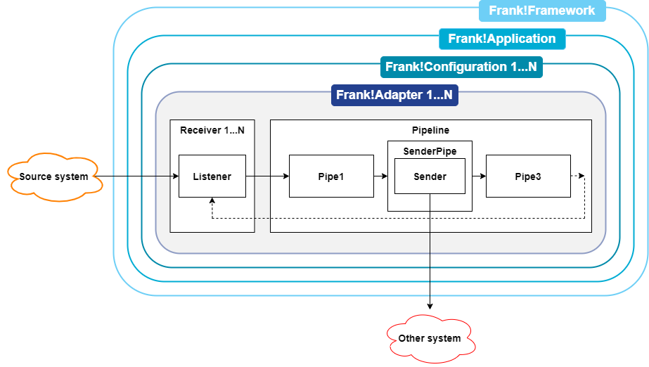

Community website
=================

Visit our community website and become a member at: https://ibissource.org/

Before [Contributing](CONTRIBUTING.md) please read our [Code of Conduct](CODE_OF_CONDUCT.md).

Ibis AdapterFramework
=====================

Build adapters using XML configuration. Build applications using adapters.

Some example XML configurations:
- [HelloWorld](example/src/main/resources/ConfigurationHelloWorld.xml)
- [HelloWorlds](example/src/main/resources/ConfigurationHelloWorlds.xml)
- [ManageDatabase](core/src/main/resources/IAF_Util/ConfigurationManageDatabase.xml)

See them in action: http://ibis4example.ibissource.org/

The Ibis Adapter Framework is being renamed to "Frank!Framework". There is a user manual, the Frank!Manual, which can be found at <http://frank-manual.readthedocs.io>. If you want to contribute to this manual, please go to <http://github.com/ibissource/frank-manual>.

Releases
========

See [release notes](RELEASES.md).

Mailing list
============

The Ibis community can be contacted via
https://groups.google.com/d/forum/ibissource. You can join this mailing list by 
sending a message to ibissource+subscribe@googlegroups.com.

