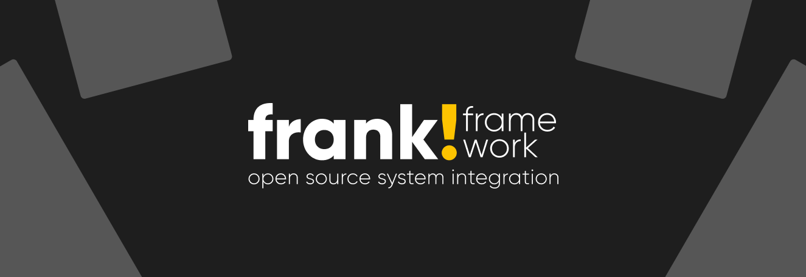

Frank!Framework
===============
**Exchange, modify and aggregate messages between systems!**

## Open-Source, Low-Code & Stateless
The Frank!Framework is a framework that is completely configurable through XML configurations. Each Frank!Application may contain multiple configurations, and each configuration can consist of multiple end-to-end connections which we call 'adapters'. Configurations may be (re)loaded conditionally or individually for optimal performance and customizability.
The application may be managed and monitored through a web interface or REST API.
See it in action: https://frank2example.frankframework.org

## Running the Frank-Framework 
The Frank!Framework can run on any java runtime, so you have your choice of application server. In our CI we test every PR and Release against Tomcat, Wildfly and JBoss, all these application servers may be used in production environments.
You may [create containers](/docker/README.md) to run the framework using the beforementioned application servers. Please note that they are for development use only, more info about using and creating them can be found in [Docker.md](Docker.md).

All production-ready containers will be pushed to our [Nexus Repository Manager](https://nexus.frankframework.org/) `frankframework-docker` repository. Helm charts are available [in the charts repository](https://github.com/frankframework/charts).

## Rebranding
The Ibis Adapter Framework has been renamed to "Frank!Framework". The migration is a work in progress, which is why you may encounter some old(er) names throughout our source code. Don't worry, everything will remain fully backwards compatible!

## Releases
All our releases can be found on Maven central. Individual builds can be found on our Nexus repository [here](https://nexus.frankframework.org).
For more information about our releases (such as improvements, non-backwards compatibility changes and security fixes), see the release notes of your version [here](https://github.com/frankframework/frankframework/releases).

## Security
It is important to remember that the security of your Frank!Application is the result of the overall security of the hosting stack; the Java runtime, Application Server, Frank!Framework and your configuration.

It is our responsibility that there are no vulnerabilities in the Frank!Framework itself and all it's Java dependencies. In turn it is your responsibility to keep your Frank!Framework version up to date and ensure there are no vulnerabilities in your configuration.
More information about reporting vulnerabilities, supported versions and how we deal with CVE's can be found in our [Security Policy](SECURITY.md).

## Feedback
For bug reports and feature requests, create a new issue at <https://github.com/frankframework/frankframework/issues>. 
For general questions feel free to post them on our [discussions forum](https://github.com/frankframework/frankframework/discussions) here on GitHub. 
If you would like to report a vulnerability, or have security concerns regarding the Frank!Framework, please email security@frankframework.org and include the word "SECURITY" in the subject line.

## Frank!Manual
In need of help? Our manual can be found at <http://frank-manual.readthedocs.io>. If you cannot find an answer to your question feel free to [submit a question in discussions](https://github.com/frankframework/frankframework/discussions). If you want to contribute to our manual, the sources can be found [here](https://github.com/frankframework/frank-manual).

## Contributing
Eager to help us expand or enhance our framework? 
Please read our [Code of Conduct](CODE_OF_CONDUCT.md) before [Contributing](CONTRIBUTING.md).
